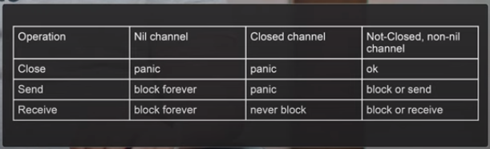
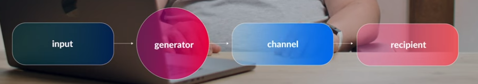

# concurrency-patterns  

Here's an attempt to reproduce the generating patterns described in the AvitoTech YouTube [video](https://www.youtube.com/watch?v=GZSfn-8m-ko&ab_channel=AvitoTech)

# Generative
  

Generating patterns are patterns that guide the data through one or more execution steps with possible modification of the data  

-- close the channel where we created it. Otherwise, you will need to create additional synchronization logic so that there will not be more than one attempt to close the channel, which may lead to panic

-- reading goroutines should never try to close the channel  

## Generator

The generator pattern is used to create an ordered sequence of values, potentially infinite.  

When you need to read messages and process them in separate goroutines without blocking the reading from the queue (from a message broker or browser WebSocket). The generator will only handle reading from this queue into a buffered channel. Writing won't be blocked as long as there's space in the buffer.

## Fan in a.k.a multiplexor  

The Fan In pattern combines multiple inputs into a single output channel, i.e., it multiplexes. The order of output is not guaranteed!

Using the pattern when:

We want to limit concurrently executed requests to an external service, like a read limiter, where only one request is being processed at any given time.

Example: sending an email. Multiple goroutines generate various parts of the email, and one goroutine sends all this data to an external service in a single stream. The order of sending is not guaranteed.

  

## Fan out 

A useful pattern for distributing processing among multiple homogeneous goroutines. Not to be confused with publish-subscribe, as a message delivered to one subscriber cannot be delivered to another subscriber.  

Example: distributing processing among different I/O-bound goroutines, such as making network requests or load balancing between channels, as the scheduler will distribute work among different fanOut goroutines.
  
  

## Pipeline

Pipeline represents a sequence of stages connected by channels, where each stage is a group of goroutines performing the same function. At each stage, goroutines receive values from the previous stage through input channels, process them, and send new values to the next stage through output channels. Each stage can have an arbitrary number of input and output channels, except for the first stage which only has a single input channel, and the last stage which only has a single output channel. The first stage serves as a producer, the last stage serves as a consumer, and the stages in between act as middleware.  

Example: We need to enrich and transform data using various external services. The sequence of actions is strictly sequential for each incoming message.

We receive the product ID as input -> use the price calculation service in rubles -> use the currency conversion service -> add discounts from the discount service.

It is assumed that this procedure will be triggered when adding a product or changing the price.  

  

# Sync

## mutex
  
Use the standard mutex if you need to lock access to shared resources and do not require acquiring or passing additional data for processing. This is definitely faster than implementing it with channels, as channels inherently involve mutexes. Here's a simple example for practice.  

## semaphore  

Semaphore a.k.a. limited parallelism. Allows restricting the number of concurrently executing unblocked goroutines. Another example of a pattern that can be used to implement a Read Limiter. Essentially, it resembles a mutex, but with a buffered channel.  

# Parallel computing

## worker pool  
A worker pool allows us to distribute work among multiple worker goroutines simultaneously.  

The execution order is not guaranteed.  

It can be applied anywhere: any tasks that can be executed independently. For example, a monitoring service that needs to poll targets to check if they are currently accessible, and there are no dependencies between the targets.    

## queue  

The queue allows processing up to N messages concurrently without waiting for their completion.

It is used wherever we can create deferred tasks that do not need to be awaited immediately. For example, sending emails or metrics.